<h1 style="text-align: center;">远洋的技术周刊(总第 1 期)</h1>

<h2 style="text-align: center;">深度阅读</h2>

+   [Deep In CORS](https://ieftimov.com/post/deep-dive-cors-history-how-it-works-best-practices/)

    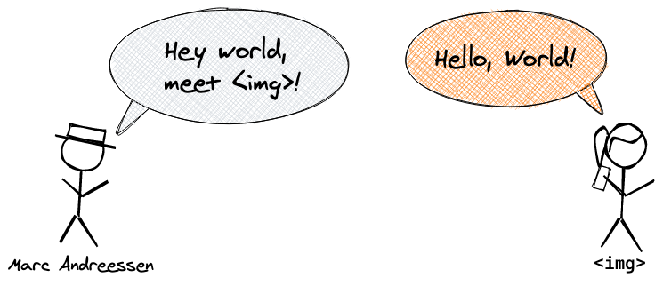

    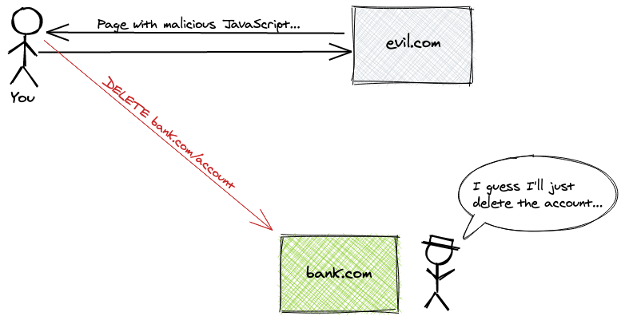

+   [美团酒旅数据治理实践](https://tech.meituan.com/2021/04/15/data-governance-in-meituan-jiulv.html)

    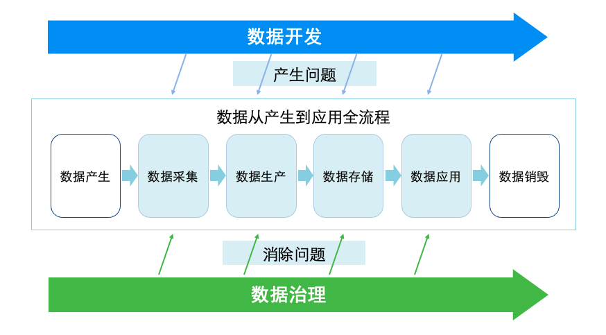

<!-- 本周热点 -->

<h2 style="text-align: center;">本周热点</h2>

+   [关于福岛核废水排放的争论，你需要知道](https://new.qq.com/omn/20210416/20210416A02LDI00.html)

    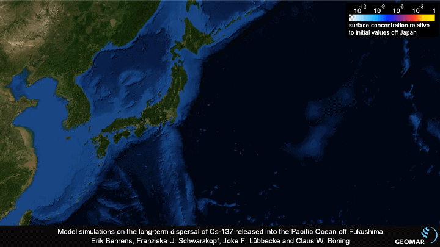

+   [菜鸟驿站可以免费送货上门了，覆盖北上杭，丰巢要跟上吗？](https://finance.sina.com.cn/tech/2021-04-15/doc-ikmyaawa9800232.shtml)

+   [Google Chrome 90正式版发布：支持AV1编码、速度更快](https://finance.sina.com.cn/tech/2021-04-13/doc-ikmyaawa9464555.shtml)

    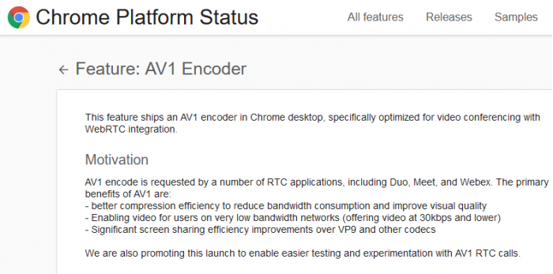

+   现在可以抢先体验如何轻松创作高保真数字人类了

    虚幻引擎推出了一款云端流送应用“MetaHuman Creator”。它可以在不牺牲质量的前提下，使实时数字人类的创作时间从数周、数月缩短到一小时内。它的工作原理是根据一个不断增长的、丰富的人类外表与动作库进行绘制，并且允许你使用直观的工作流程雕刻和制作想要的结果，从而创作出可信的新角色。

    用户可在大约30种发型中进行选择，它们可以使用虚幻引擎的基于发束的毛发，也可使用适合低端平台的发片。同时还提供18种不同比例的体型。当制作出满意的人物后，就可以通过Quixel Bridge下载资源。它们配有完整的LOD和齐全的骨架绑定，可在虚幻引擎中用于动画和动作捕捉。

    现在，MetaHuman Creator开启了免费抢先体验计划。

    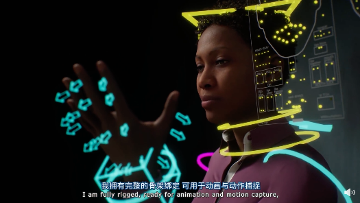

<h2 style="text-align: center;">工具推荐</h2>

+   [GitHub 发布了一个同名的 VSCode 主题系列](https://marketplace.visualstudio.com/items?itemName=GitHub.github-vscode-theme)

    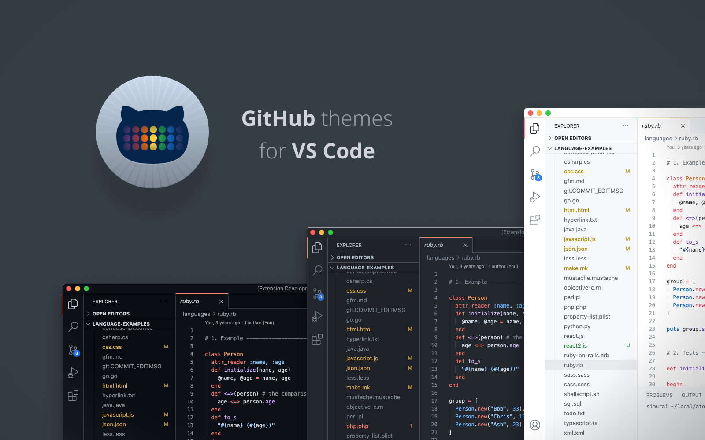

+   [Tmux入门指南](https://sunainapai.in/blog/get-started-with-tmux/)

    在一个窗口内使用多终端。

    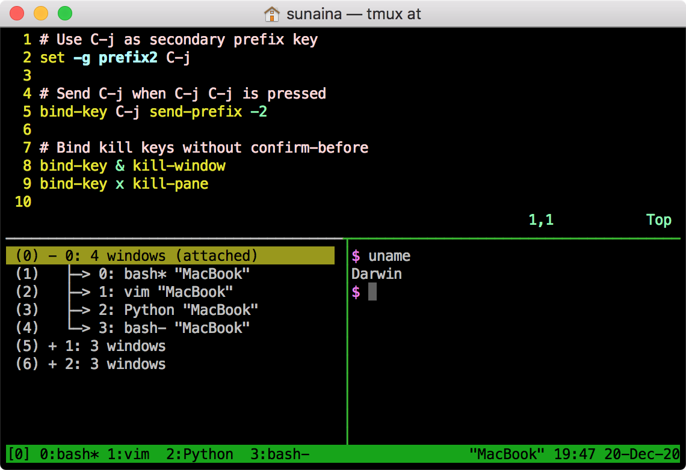

+   [程序员不知道写什么的时候，可以看看这个网站，Product Hunt 上最受欢迎的产品排行](https://pragli.com/leaderboard-for-product-hunt/)

    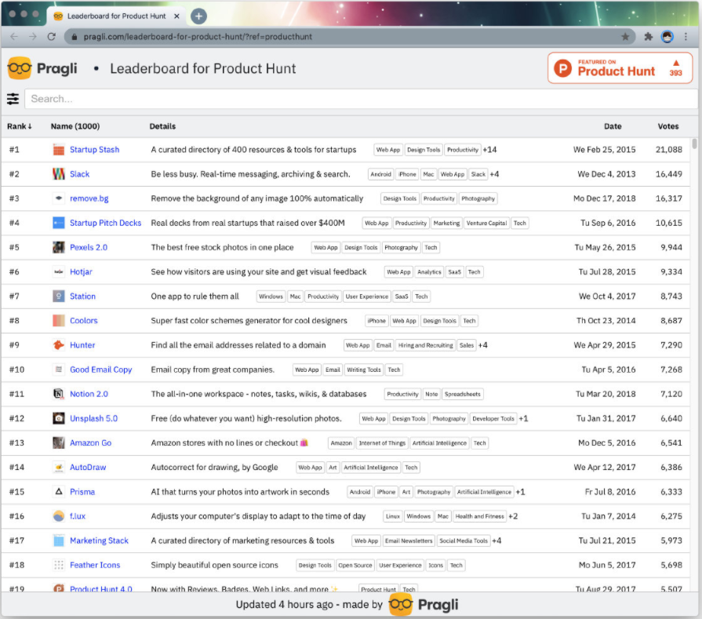

+   好看的文字排版 

    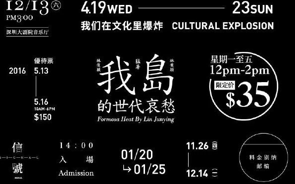

    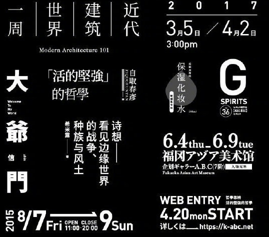

    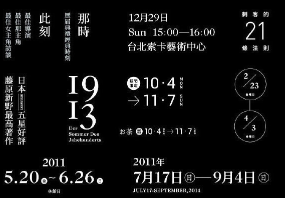

<!-- 投稿 -->

<h2 style="text-align: center;">其他推荐</h2>

+   [0糖、0蔗糖、果糖的区别](https://mp.weixin.qq.com/s/E7cqhJv42RdLyFDm3-kMhw)

    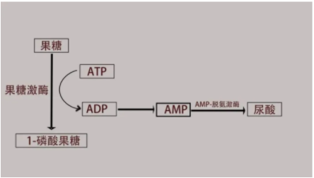

+   [熬夜时，为什么有时候心脏会‘咯噔’一下](https://mp.weixin.qq.com/s/1H0Csen8wleVkV5qmG8COA)

    

+   一个有点意思的公众号：大都会电讯。

    >   我们讲述两百年后的新闻故事。

    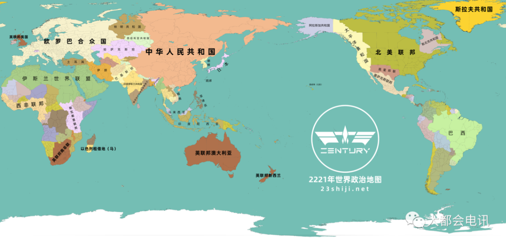
